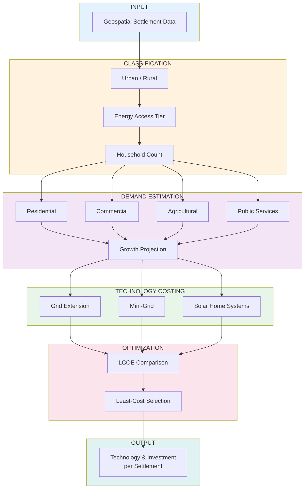

# Settlement-Level Least-Cost Electrification (Benin, 2025-2040)

[](https://www.python.org/downloads/)
[](LICENSE)
[](CHANGELOG.md)

Open-source toolkit combining geospatial analytics with Multi-Tier demand modelling and strict LCOE costing.

**Why it stands out**
- Spatial resolution: every known settlement evaluated.
- Technology-agnostic: grid, mini-grid, and SHS cost curves in one model.
- Transparent parameters: all assumptions centralized in `parameters.py`.
- Reproducible: single CLI command or Python API call.
- Policy-ready outputs: investment and technology map directly usable by planners, financiers, and researchers.

## Headline numbers

| Technology | Settlements | Population | Investment |
|------------|-------------|------------|------------|
| Grid | 1,523 (9%) | 11.5M (81%) | $1.58B |
| Mini-Grid | 7,552 (44%) | 2.1M (15%) | $0.67B |
| SHS | 8,130 (47%) | 0.5M (4%) | $0.01B |
| **Total** | **17,205** | **14.1M** | **$2.26B** |

## Workflow



**Approach:**
1. **Classification** - Categorize settlements by urbanization level and energy access tier using demographic and wealth indicators
2. **Demand** - Estimate sectoral electricity demand (residential, productive, public) and project growth over planning horizon
3. **Costing** - Calculate Levelized Cost of Electricity (LCOE) for each technology option based on infrastructure distances and load characteristics
4. **Optimization** - Select least-cost technology per settlement considering technical constraints

## Data

**Required:** `geometry`, `population`

**Optional:** `num_buildings`, `mean_rwi`, `has_nightlight`, `dist_to_substations`, `distance_to_existing_transmission_lines`, `dist_main_road_km`, `dist_lake_river_km`, `num_health_facilities`, `num_education_facilities`

## Installation

```bash
git clone https://github.com/BadibossPy/settlement-level-electrification-optimization-benin.git
cd settlement-level-electrification-optimization-benin
pip install -e .
```

## Usage

**CLI:**
```bash
python run_model.py --input data/settlements.geojson --output results.geojson
```

**Python API:**
```python
import geopandas as gpd
from benin_least_cost.parameters import ProjectConfig
from benin_least_cost.demand import run_demand_model
from benin_least_cost.lcoe import run_lcoe_model

gdf = gpd.read_file("data/settlements.geojson")
config = ProjectConfig()
gdf = run_demand_model(gdf, config)
gdf = run_lcoe_model(gdf, config)
print(gdf["optimal_tech"].value_counts())
```

## Output Fields

- `projected_demand` - Annual demand 2040 (kWh/year)
- `projected_peak` - Peak load (kW)
- `lcoe_grid`, `lcoe_mg`, `lcoe_shs` - LCOE per technology (USD/kWh)
- `optimal_tech` - Selected technology (Grid / MiniGrid / SHS)
- `investment` - CAPEX for selected technology (USD)

## Parameters

All parameters in `benin_least_cost/parameters.py`:
- Planning: discount rate 8%, horizon 15 years, population growth 2.7%
- Grid: MV $14,000/km, LV $5,500/km, transformer $8,000, losses 18%
- Mini-Grid: PV $700/kW, battery $300/kWh, CF 18%
- SHS: $80-$600 per household by tier

## Structure

```
├── benin_least_cost/      # Core Python package
│   ├── demand.py          # Demand estimation
│   ├── lcoe.py            # LCOE and selection
│   ├── parameters.py      # All parameters
│   └── schema.py          # Data validation
├── run_model.py           # CLI entry point
├── tests/
│   └── test_logic.py      # Unit tests
├── data/
│   └── settlements.geojson
├── notebooks/             # Optional visualization
│   └── electrification_analysis.ipynb
└── requirements.txt
```

## Next steps

### Input preparation
- **Settlement points** — any GeoJSON/GeoPackage with at least `geometry` and `population`. Optional columns (buildings, RWI, distances, facilities) improve accuracy.
- **Infrastructure distances** — compute `dist_to_substations`, `distance_to_existing_transmission_lines`, and `dist_main_road_km` with standard GIS nearest-line tools (PostGIS `ST_Distance`, QGIS ‘Distance to nearest hub’).
- **Wealth proxy (RWI)** — download raster from WorldPop Relative Wealth Index, sample mean value at each settlement.
- **Night-lights** — VIIRS night-time lights, threshold >0 to upgrade Tier 1 settlements to Tier 2.
- **Facilities** — point layers of health and education sites, aggregated per settlement.

### Data sources
- WorldPop 2025 population, relative wealth index
- GRID3 settlement layers (Benin)
- World Bank night-lights (VIIRS, 2024 composite)
- OpenStreetMap roads, health, and education facilities (Geofabrik extract)
- Africa Electricity Transmission & Substation GIS (KTH / World Bank)

### Roadmap
1. **Scenario module** — run sensitivities (cost decline, discount rate) via YAML config.
2. **Web map** — publish results and methodology on an interactive map.
3. **Integration** — link with national least-cost grid expansion tools (e.g., NetworkPlanner) for corridor optimisation.

## Verification

```bash
pytest tests/
```

