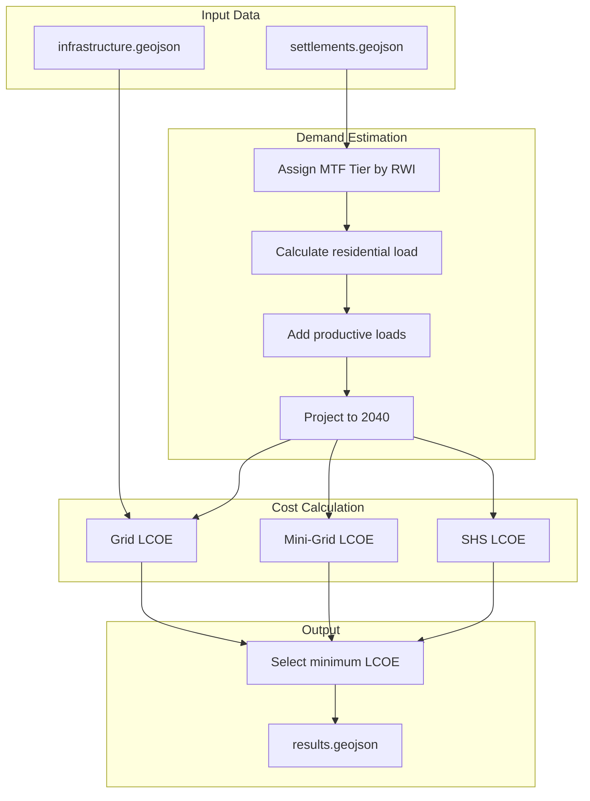

# Benin Least-Cost Electrification Model (2025–2040)

Settlement-level electrification planning for Benin. Compares Grid Extension, Mini-Grid, and Solar Home Systems (SHS) for 17,205 settlements.

## Results Summary

| Metric | Value |
|--------|-------|
| Settlements analyzed | 17,205 |
| Total investment | USD 2.4 Billion |
| Grid extension | 9% of settlements |
| Mini-Grid | 63% of settlements |
| SHS | 28% of settlements |

## Architecture



## Strategy

The model answers: **What is the cheapest way to electrify each settlement?**

For each of 17,205 settlements:
1. Estimate electricity demand based on population, wealth, and productive activities
2. Calculate the cost per kWh (LCOE) for three technology options
3. Select the cheapest option

### Why these results?

**Grid (9%)**: Only cost-effective for settlements close to existing infrastructure. MV line costs ($14,000/km) make grid extension expensive beyond ~5km from substations.

**Mini-Grid (63%)**: Optimal for most rural settlements. Solar+battery systems serve populations of 200-5000 people with productive loads (mills, irrigation, health centers) more cheaply than extending the grid.

**SHS (28%)**: Best for small, dispersed settlements with low demand. A $80-250 system per household beats building any shared infrastructure when demand is under 150 kWh/year per household.

## Assumptions

### Demand Model

**Household consumption** is assigned using the Multi-Tier Framework (MTF):

| Wealth Level (RWI) | Tier | Annual Demand |
|-------------------|------|---------------|
| Poor (< -0.3) | 1 | 35 kWh/hh |
| Middle (-0.3 to 0.4) | 2 | 220 kWh/hh |
| Higher (> 0.4) | 3 | 850 kWh/hh |

**Productive loads** are added based on settlement characteristics:

| Load Type | Demand | When Applied |
|-----------|--------|--------------|
| Health center | 4,000 kWh/yr | Per facility present |
| School | 1,500 kWh/yr | Per facility present |
| Grain mill | 4,500 kWh/yr | Rural settlements > 500 people |
| Irrigation pump | 3,500 kWh/yr | Settlements < 3km from water |
| Crop dryer | 6,000 kWh/yr | Northern region (> 8°N) for cashew/shea |

**Growth projection**: Demand grows at 2.7% (population) + 1.5% (wealth) annually for 15 years.

### Cost Model

**Grid Extension**:
- MV line: $14,000/km
- LV line: $5,500/km  
- Transformer: $8,000 per 45kVA unit
- Connection: $150/household
- Losses: 18%
- Lifetime: 40 years

**Mini-Grid (Solar + Battery)**:
- PV panels: $700/kWp
- Battery: $300/kWh (replaced every 7 years)
- Inverter: $180/kW
- Capacity factor: 18%
- Lifetime: 20 years

**Solar Home System**:
- Tier 1: $80 (35 kWh/yr capacity)
- Tier 2: $250 (150 kWh/yr capacity)
- Tier 3: $600 (350 kWh/yr capacity)
- Lifetime: 5 years

**Discount rate**: 8% for all technologies

### Key Constraints

1. **SHS cannot serve productive loads**. Settlements with health centers, schools, mills, or irrigation automatically exclude SHS.

2. **Grid distance penalty**. Settlements >10km from paved roads get 30% higher grid construction costs.

3. **Northern agricultural loads**. Settlements above 8°N latitude get crop dryer loads (cashew and shea processing zone).

## Insights

### Geographic Patterns

1. **Coastal/urban belt** (Cotonou to Porto-Novo): Grid dominates due to existing infrastructure density.

2. **Central agricultural zone**: Mini-grids win because mills and irrigation pumps require more power than SHS can provide.

3. **Northern savanna**: Mixed allocation. Agricultural centers need mini-grids; pastoral villages get SHS.

### Investment Breakdown

| Technology | Investment | Cost per Person |
|------------|-----------|-----------------|
| Grid | ~$500M | ~$200 |
| Mini-Grid | ~$1.6B | ~$150 |
| SHS | ~$300M | ~$80 |

### Sensitivity

The model is most sensitive to:
- **Grid distance**: Beyond 5km from substations, grid rarely wins
- **Productive loads**: Any commercial/agricultural load shifts away from SHS
- **Population**: Settlements >500 people favor mini-grids (economies of scale)

## Limitations

1. **Static model**: Does not sequence grid expansion over time
2. **No diesel backup**: Mini-grids assume 100% solar+battery
3. **Uniform solar resource**: Uses 18% capacity factor nationwide
4. **Euclidean distances**: Road network topology not modeled
5. **No financing costs**: Only discount rate, not subsidies or loans

## Usage

### Install

```bash
pip install -r requirements.txt
```

### Run

```bash
python run_model.py --input data/settlements.geojson --output results.geojson
```

### Programmatic

```python
import geopandas as gpd
from benin_least_cost.parameters import ProjectConfig
from benin_least_cost.demand import run_demand_model
from benin_least_cost.lcoe import run_lcoe_model

gdf = gpd.read_file("data/settlements.geojson")
config = ProjectConfig()

# Modify parameters if needed
config.planning.discount_rate = 0.10

gdf = run_demand_model(gdf, config)
gdf = run_lcoe_model(gdf, config)

# Filter results
minigrid_sites = gdf[gdf["optimal_tech"] == "MiniGrid"]
```

## Input Data

Required fields in `settlements.geojson`:

| Field | Required | Description |
|-------|----------|-------------|
| `geometry` | Yes | Point or polygon |
| `population` | Yes | Settlement population |
| `mean_rwi` | No | Relative Wealth Index |
| `dist_to_substations` | No | km to nearest substation |
| `num_health_facilities` | No | Health centers count |
| `num_education_facilities` | No | Schools count |

## Output Data

Each settlement gets:

| Field | Description |
|-------|-------------|
| `projected_demand` | kWh/year (2040) |
| `lcoe_grid` | Grid cost ($/kWh) |
| `lcoe_mg` | Mini-grid cost ($/kWh) |
| `lcoe_shs` | SHS cost ($/kWh) |
| `optimal_tech` | Grid / MiniGrid / SHS |
| `investment` | Required USD |

## Project Structure

```
├── benin_least_cost/
│   ├── demand.py       # Demand estimation
│   ├── lcoe.py         # LCOE calculation
│   ├── parameters.py   # All configurable values
│   └── schema.py       # Field definitions
├── data/
│   ├── settlements.geojson
│   └── infrastructure.geojson
├── run_model.py        # CLI entry point
└── requirements.txt
```

## Parameters

All values in `parameters.py` can be modified:

```python
config = ProjectConfig()
config.planning.discount_rate = 0.10      # Default: 0.08
config.grid.mv_cost_per_km = 16000        # Default: 14000
config.minigrid.pv_cost_per_kw = 600      # Default: 700
```
