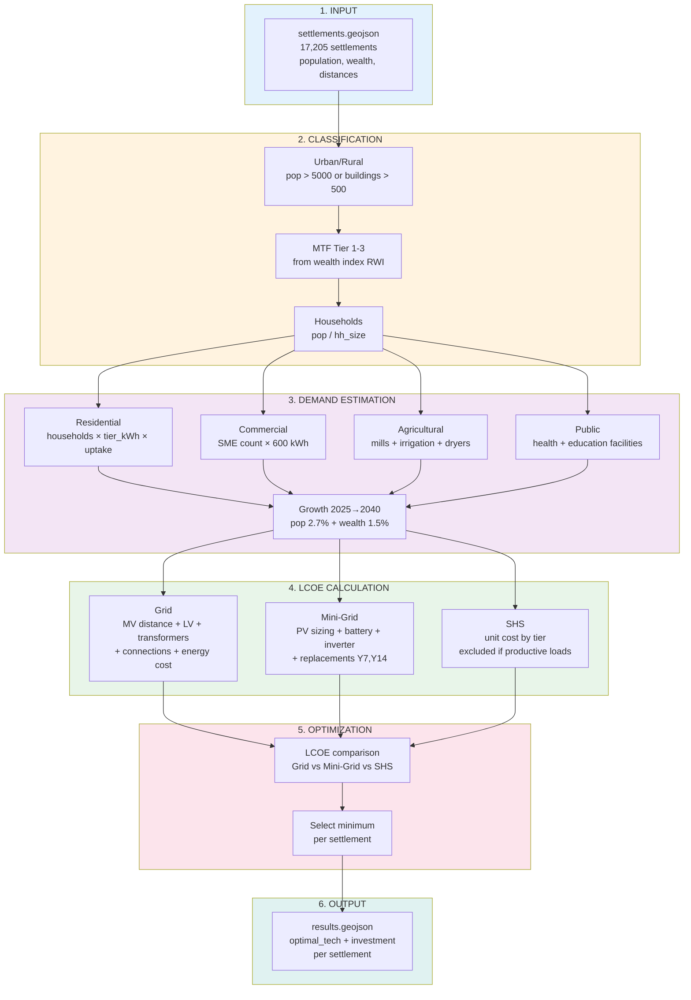

# Settlement-Level Least-Cost Electrification (Benin, 2025-2040)

Least-cost electrification model for 17,205 settlements in Benin comparing Grid, Mini-Grid, and Solar Home Systems (SHS).

## Results

| Technology | Settlements | Population | Investment |
|------------|-------------|------------|------------|
| Grid | 1,523 (9%) | 11.5M (81%) | $1.58B |
| Mini-Grid | 7,552 (44%) | 2.1M (15%) | $0.67B |
| SHS | 8,130 (47%) | 0.5M (4%) | $0.01B |
| **Total** | **17,205** | **14.1M** | **$2.26B** |

## Workflow



## Data

**Required:** `geometry`, `population`

**Optional:** `num_buildings`, `mean_rwi`, `has_nightlight`, `dist_to_substations`, `distance_to_existing_transmission_lines`, `dist_main_road_km`, `dist_lake_river_km`, `num_health_facilities`, `num_education_facilities`

## Usage

```bash
pip install -r requirements.txt
python run_model.py --input data/settlements.geojson --output results.geojson
```

## Output Fields

- `projected_demand` - Annual demand 2040 (kWh/year)
- `projected_peak` - Peak load (kW)
- `lcoe_grid`, `lcoe_mg`, `lcoe_shs` - LCOE per technology (USD/kWh)
- `optimal_tech` - Selected technology (Grid / MiniGrid / SHS)
- `investment` - CAPEX for selected technology (USD)

## Parameters

All parameters in `benin_least_cost/parameters.py`:
- Planning: discount rate 8%, horizon 15 years, population growth 2.7%
- Grid: MV $14,000/km, LV $5,500/km, transformer $8,000, losses 18%
- Mini-Grid: PV $700/kW, battery $300/kWh, CF 18%
- SHS: $80-$600 per household by tier

## Structure

```
├── benin_least_cost/
│   ├── demand.py      # Demand estimation
│   ├── lcoe.py        # LCOE and selection
│   ├── parameters.py  # All parameters
│   └── schema.py      # Data validation
├── data/
│   └── settlements.geojson
├── notebooks/
│   └── electrification_analysis.ipynb
├── run_model.py
└── requirements.txt
```

## Verification

```bash
pytest tests/
jupyter nbconvert --execute notebooks/electrification_analysis.ipynb
```

