# Settlement-Level Least-Cost Electrification (Benin, 2025-2040)

Least-cost electrification model for 17,205 settlements in Benin. Compares Grid Extension, Mini-Grid (solar PV + battery), and Solar Home Systems (SHS) using levelized cost of electricity (LCOE). The model implements the ESMAP Multi-Tier Framework for demand estimation and performs techno-economic optimization at the settlement level.

## Results

| Metric | Value |
|--------|-------|
| Settlements | 17,205 |
| Population | 14,111,192 |
| Grid | 1,523 (9%) |
| Mini-Grid | 7,552 (44%) |
| SHS | 8,130 (47%) |
| Total Investment | USD 2.26B |
| Projected Demand (2040) | 2,694 GWh/year |

## Key Findings

| Technology | Settlements | Population | Demand (GWh) | Investment | Per Capita | Avg LCOE |
|------------|-------------|------------|--------------|------------|------------|----------|
| Grid | 1,523 (9%) | 11.5M (81%) | 2,532 (94%) | $1.58B (70%) | $137 | $0.38/kWh |
| Mini-Grid | 7,552 (44%) | 2.1M (15%) | 147 (5%) | $0.67B (30%) | $317 | $0.80/kWh |
| SHS | 8,130 (47%) | 0.5M (4%) | 14 (1%) | $0.01B (0%) | $26 | $0.63/kWh |

**Implications:**
- Grid extension serves the minority of settlements (9%) but captures 81% of population and 94% of demand
- Decentralized solutions (Mini-Grid + SHS) dominate settlement count (91%) but serve only 19% of population
- Grid LCOE is lowest ($0.38/kWh) due to economies of scale, despite higher per-capita investment ($137)
- Mini-Grids serve medium-sized settlements with higher per-capita costs ($317) but moderate LCOE ($0.80/kWh)
- SHS serves smallest settlements with lowest per-capita cost ($26) but limited capacity (35-350 kWh/year/household)

### Decision context

- **Government and regulators**: spatial rollout can prioritize the 1,523 grid-ready settlements to capture 81% of population while deploying rural incentives for remaining 91% of settlements that require decentralized systems.
- **Utilities and system planners**: grid investments concentrate in corridors where `dist_to_substations` is low; remote nodes beyond ~35 km from backbone (median Mini-Grid distance) show diminishing returns for grid.
- **Banks and DFIs**: capital deployment ratio Grid:Mini-Grid:SHS = 70:30:<1 underscores where concessional lines should target (Mini-Grid clusters) while SHS needs mostly working-capital style facilities.
- **Startups and IPPs**: Mini-Grid nodes average 2,100 people and 147 GWh/year of demand, defining market size for portfolio aggregation; SHS nodes average 62 households with negligible productive load.
- **Research and academia**: the dataset (17,205 observations, validated schema, executed notebook) is reproducible and extensible for scenario analysis (discount rate, demand, technology costs).

## Method

The model estimates electricity demand per settlement and calculates LCOE for three technologies. The technology with minimum LCOE is selected.

### Demand Estimation

**Household count**

```
households = ceil(population / hh_size)
```

where hh_size = 4.3 (urban) or 5.2 (rural).

**Tier assignment** (Multi-Tier Framework)

```
tier = 1 if RWI < -0.3 else 2 if RWI < 0.4 else 3
```

**Residential demand**

```
E_res = households * tier_kwh[tier] * uptake
```

where tier_kwh = {1: 35, 2: 220, 3: 850} kWh/year per household, uptake = 0.85 (rural) or 0.95 (urban).

**Productive demand**

- Commercial: SMEs estimated from building density and distance to hubs (600 kWh/year per SME)
- Agricultural: Mills, irrigation pumps, dryers allocated based on population and location
- Public: Health facilities (4,000 kWh/year) and schools (1,500 kWh/year)

**Growth projection**

```
G = (1 + g_pop) * (1 + g_wealth) ** H
E_proj = (E_res + E_comm + E_agri + E_pub) * G
```

with g_pop = 0.027, g_wealth = 0.015, H = 15 years.

**Peak load**

```
P_peak = E_proj / (8760 * LF[tier])
```

where LF = load factor (0.18 for tier 1, 0.20 for tier 2, 0.25 for tier 3).

### Cost Model

**Capital Recovery Factor**

```
CRF(r, n) = r * (1+r)**n / ((1+r)**n - 1)
```

with discount rate r = 0.08.

**Grid Extension**

Grid LCOE accounts for:
- MV line: $14,000/km (with 30% penalty if >10km from paved roads)
- LV distribution: $5,500/km
- Transformers: $8,000 per 45kVA unit
- Connections: $150/household
- Losses: 18%
- Energy cost: $0.10/kWh

**Mini-Grid** (solar + battery)

PV sizing:

```
PV_kW = (E_proj / 365) / (CF * 24 * eta) * 1.2
```

with CF = 0.18 (capacity factor), eta = 0.85 (system efficiency).

Battery sizing:

```
Batt_kWh = (E_proj / 365) / DoD
```

with DoD = 0.8 (depth of discharge). Battery replacements at years 7 and 14 are included in NPV.

Costs: PV $700/kWp, Battery $300/kWh, Inverter $180/kW.

**Solar Home Systems**

SHS costs per tier: {1: $80, 2: $250, 3: $600} per household.

Energy capacity limits: {1: 35, 2: 150, 3: 350} kWh/year per household.

SHS is excluded if the settlement has productive loads (commercial, agricultural, or public facilities).

### Selection

```
optimal_tech = argmin([LCOE_grid, LCOE_mg, LCOE_shs])
```

## Implementation Workflow

```mermaid
flowchart TB
    subgraph Input["📥 INPUT DATA"]
        A1[Settlement Data<br/>17,205 locations<br/>Population, wealth, infrastructure]
    end
    
    subgraph Stage1["🏘️ SETTLEMENT ANALYSIS"]
        B1[Classify Urban vs Rural<br/>Based on population and building density]
        B2[Assign Energy Access Tier<br/>Tier 1, 2, or 3 based on wealth index]
        B3[Count Households<br/>Estimate household numbers]
    end
    
    subgraph Stage2["⚡ DEMAND ESTIMATION"]
        C1[Residential Demand<br/>Household consumption by tier]
        C2[Commercial Demand<br/>Small businesses and shops]
        C3[Agricultural Demand<br/>Mills, irrigation, dryers]
        C4[Public Services<br/>Health facilities and schools]
        C5[Apply Growth to 2040<br/>Population + wealth growth]
    end
    
    subgraph Stage3["💰 COST ANALYSIS"]
        D1[Grid Extension<br/>Distance to grid<br/>Line costs, transformers<br/>Connection fees]
        D2[Mini-Grid<br/>Solar panels<br/>Battery storage<br/>Inverters]
        D3[Solar Home Systems<br/>Individual household<br/>systems by tier]
    end
    
    subgraph Stage4["🎯 OPTIMIZATION"]
        E1[Calculate Cost per kWh<br/>Levelized Cost of Electricity]
        E2[Select Cheapest Option<br/>Grid, Mini-Grid, or SHS]
    end
    
    subgraph Output["📊 RESULTS"]
        F1[Technology Assignment<br/>per Settlement]
        F2[Investment Requirements<br/>per Settlement]
        F3[Aggregate Statistics<br/>Total investment: $2.26B<br/>Grid: 9% settlements, 81% population<br/>Mini-Grid: 44% settlements, 15% population<br/>SHS: 47% settlements, 4% population]
    end
    
    A1 --> B1
    B1 --> B2
    B2 --> B3
    
    B3 --> C1
    B3 --> C2
    B3 --> C3
    B3 --> C4
    
    C1 --> C5
    C2 --> C5
    C3 --> C5
    C4 --> C5
    
    C5 --> D1
    C5 --> D2
    C5 --> D3
    
    D1 --> E1
    D2 --> E1
    D3 --> E1
    
    E1 --> E2
    
    E2 --> F1
    E2 --> F2
    
    F1 --> F3
    F2 --> F3
    
    style Input fill:#e3f2fd,stroke:#1976d2,stroke-width:3px
    style Stage1 fill:#fff3e0,stroke:#f57c00,stroke-width:2px
    style Stage2 fill:#f3e5f5,stroke:#7b1fa2,stroke-width:2px
    style Stage3 fill:#e8f5e9,stroke:#388e3c,stroke-width:2px
    style Stage4 fill:#fce4ec,stroke:#c2185b,stroke-width:2px
    style Output fill:#e0f2f1,stroke:#00796b,stroke-width:3px
    
    style D1 fill:#c8e6c9
    style D2 fill:#ffcc80
    style D3 fill:#fff59d
```



## Usage

### Install

```bash
pip install -r requirements.txt
```

### Run model

```bash
python run_model.py --input data/settlements.geojson --output results.geojson
```

### Notebook

`notebooks/electrification_analysis.ipynb` provides comprehensive analysis with:

1. **Spatial Distribution Map**: Geographic visualization of technology selection across Benin
2. **Economic Analysis**: Investment allocation, LCOE distributions, technology-specific cost breakdowns
3. **Demand Characteristics**: Population vs demand patterns, per-capita consumption, sectoral breakdown
4. **Technology Competitiveness**: Analysis of grid distance thresholds, demand-distance relationships
5. **Statistical Insights**: Summary tables quantifying settlement characteristics, investment efficiency, and technology trade-offs

The notebook generates publication-ready figures and quantitative insights suitable for technical reports.

### Programmatic usage

```python
import geopandas as gpd
from benin_least_cost.parameters import ProjectConfig
from benin_least_cost.demand import run_demand_model
from benin_least_cost.lcoe import run_lcoe_model

gdf = gpd.read_file("data/settlements.geojson")
config = ProjectConfig()

gdf = run_demand_model(gdf, config)
gdf = run_lcoe_model(gdf, config)

print(gdf["optimal_tech"].value_counts())
```

## Data Requirements

**Required fields:**
- geometry (point or polygon)
- population

**Optional fields** (improve accuracy):
- num_buildings, mean_rwi, has_nightlight
- dist_to_substations, distance_to_existing_transmission_lines
- dist_main_road_km, dist_lake_river_km
- num_health_facilities, num_education_facilities

## Output Fields

- projected_demand (kWh/year, 2040)
- projected_peak (kW)
- lcoe_grid, lcoe_mg, lcoe_shs (USD/kWh)
- optimal_tech (Grid / MiniGrid / SHS)
- investment (USD, CAPEX for selected technology)

## Parameters

All model parameters are in `benin_least_cost/parameters.py` and can be modified:

```python
config = ProjectConfig()
config.planning.discount_rate = 0.10  # default: 0.08
config.grid.mv_cost_per_km = 16000    # default: 14000
```

## Assumptions

- Planning horizon: 15 years (2025-2040)
- Population growth: 2.7% annually
- Wealth growth: 1.5% annually
- Discount rate: 8%
- Solar capacity factor: 18%
- Grid technical losses: 18%
- All settlements can technically receive electricity from any technology

## Limitations

- Static model (does not sequence investments over time)
- Uniform solar resource (18% CF nationwide)
- Euclidean distances (road network not modeled)
- No diesel backup for mini-grids
- No consideration of grid reliability or power quality

## Verification

- `pytest tests/test_logic.py`: validates CRF, demand growth, parameter guards, and LCOE selection logic.
- `jupyter nbconvert --to notebook --execute notebooks/electrification_analysis.ipynb`: executes all analytical cells, embeds figures, and reproduces KPIs cited above.
- `results.geojson`: generated from the latest run of `run_model.py` using `data/settlements.geojson`, ensuring README metrics reflect actual outputs.

## Project Structure

```
├── benin_least_cost/
│   ├── demand.py          # Demand estimation
│   ├── lcoe.py            # LCOE calculation
│   ├── parameters.py      # Model parameters
│   └── schema.py          # Data validation
├── data/
│   ├── settlements.geojson
│   └── infrastructure.geojson
├── notebooks/
│   └── electrification_analysis.ipynb
├── run_model.py           # CLI entry point
└── requirements.txt
```

